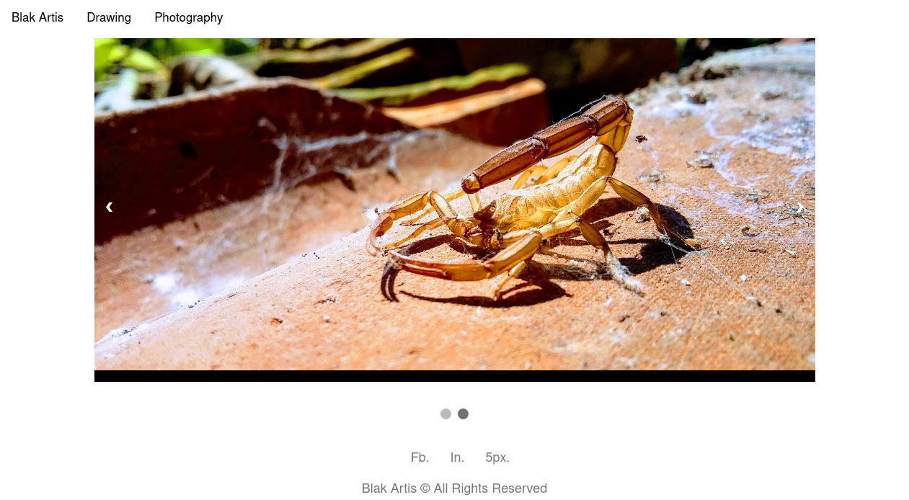
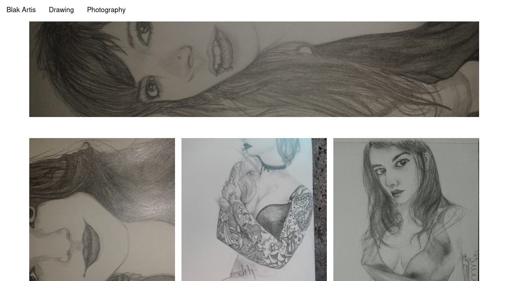
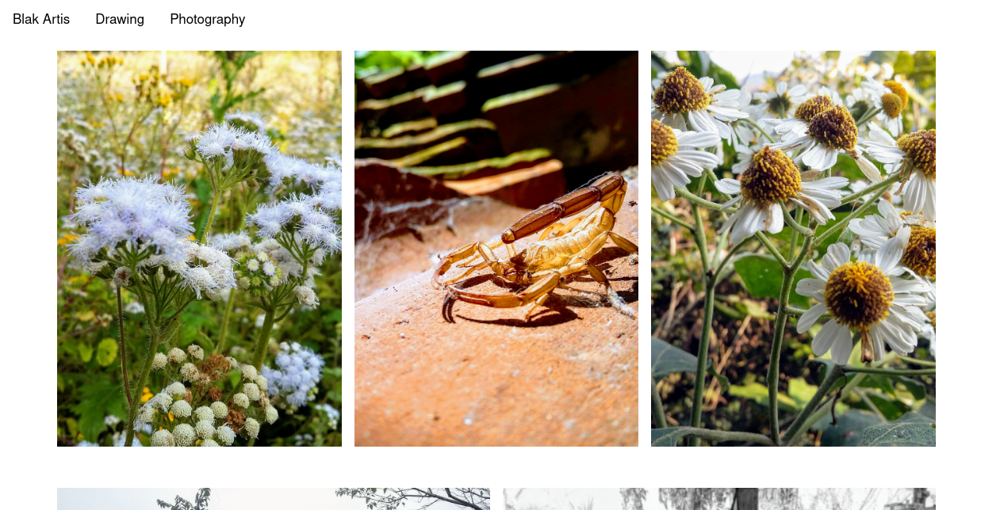

# Artis

## Intro
Web-based art portfolio, minimalist style inspired by @BlakArtis [Fb](https://www.facebook.com/blakartis), [500px](https://www.500px.com/blakartis), [Ins](https://www.instagram.com/blakartis/), [Joinher]().

A simple way to organize and visualize artworks;
Drawings and Photographs. No need for a translational database.
Just just organize in folders, How to organize? ...

```
* artwork
  * drawing 
    * 2019 
      * [Day[Month[Year]]] - [Art Name]
* photography
  * 2019
    * 12Jun2019 - Battle
```

##  Preview

### Index [1](./screeshots/index-v1.png), [2](./index2-v1.png)


### Drawing


### Photography



## Run with container `docker-compose`

```bash
    docker-compose up --build
```

## Run with Virtual Environment `pipenv`

```python
    pip install pipenv
    pipenv run pip install -r requirements.txt 
    pipenv run python app.py
```

## Roadmap

* :pushpin: Ordering artworks by date time ascending
* :pushpin: Timeline artworks and grouped by year
* :pushpin: Implement patterns style CSS
* :pushpin: Improvment theme blakartis 

## CONTRIBUTION 
[Contribution](./CONTRIBUTING.md)


## License
[Apache v2.0](./LICENSE)
